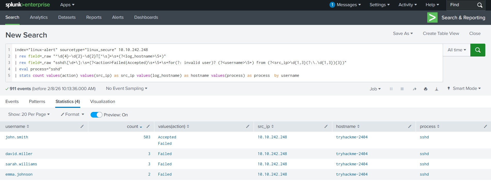
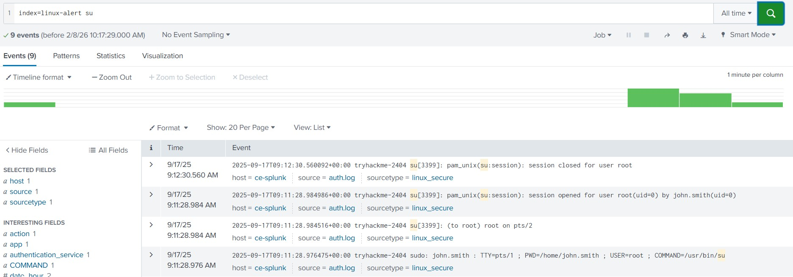
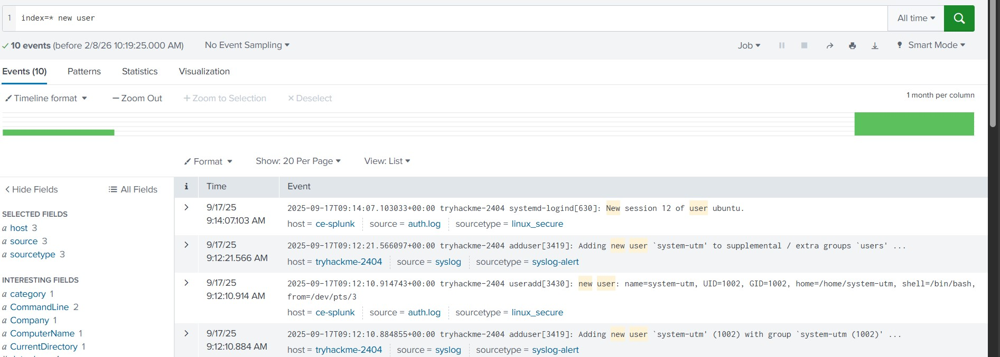

 Linux Brute Force Analysis – Task 1

## Overview
Investigated a brute force alert on a Linux host using Splunk in a SOC lab environment. The goal was to analyze login events, detect suspicious activity, and summarize findings.

## Analysis & Observations
- Alert originated from an **internal IP**, indicating potential network access.  
- Multiple failed login attempts observed, including attempts for **non-existent users**.  
- Account **john.smith** was targeted over **500 times**, confirming brute force activity.  
- Successful login for `john.smith` detected; attacker escalated to **root** and created persistent user **system-utm**.

### Alert Overview

This screenshot shows the initial security alert generated by Splunk for potential brute force activity. The alert, titled **"Brute Force Activity Detection"**, was triggered on 17/09/2025 at 9:00 AM.

The alert indicates that the target system was the Linux host `tryhackme-2404`, and the suspicious activity originated from the IP address `10.10.242.248`. Since this is a local IP address, it suggests that the source of the attack may already have access to the internal network.

The activity occurred during normal business hours, which could initially make it appear less suspicious. However, timing alone is not sufficient to rule out malicious behavior.

This alert serves as the starting point of the investigation and provides key contextual information, including the affected system, source address, and time of occurrence, which guided further analysis.

### Brute Force Attempts per User

This screenshot shows the results of analyzing Linux authentication logs in Splunk to identify login attempts per user. The query filtered events from the source IP `10.10.242.248` and extracted key fields such as `username`, `action` (Failed or Accepted), `src_ip`, and `hostname`.

From the results, we can see that the `john.smith` account received **503 login attempts**, far exceeding other accounts. These attempts include both failed and successful logins, indicating persistent brute force activity.

The high number of attempts concentrated on a single user confirms that `john.smith` was the primary target of the attack. Other users had minimal or no failed attempts, which helps distinguish legitimate login activity from malicious behavior.

These failed login attempts occurred within approximately 5 minutes, indicating a highly aggressive and automated brute force attack rather than normal user behavior.

### Privilege Escalation to Root

This screenshot shows that after successfully logging in as `john.smith`, the attacker was able to escalate privileges to the **root** account.

This was confirmed by analyzing the Linux authentication logs in Splunk, which show successful login events from the source IP and subsequent root-level activity. These events indicate that the attacker gained administrative access, allowing full control over the host `tryhackme-2404`.

Privilege escalation to root significantly increases the impact of the attack, as it enables the attacker to create new accounts, modify system configurations, or persist on the system undetected.

### Persistence Account Created – system-utm

This screenshot shows that the attacker created a new user account called **system-utm** to maintain persistent access on the Linux host `tryhackme-2404`.

The account was identified by searching the Splunk logs with the following query: 'index=* "new user"'

