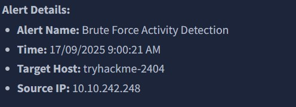

 Linux Brute Force Analysis – Task 1

## Overview
Investigated a brute force alert on a Linux host using Splunk in a SOC lab environment. The goal was to analyze login events, detect suspicious activity, and summarize findings.

## Analysis & Observations
- Alert originated from an **internal IP**, indicating potential network access.  
- Multiple failed login attempts observed, including attempts for **non-existent users**.  
- Account **john.smith** was targeted over **500 times**, confirming brute force activity.  
- Successful login for `john.smith` detected; attacker escalated to **root** and created persistent user **system-utm**.

### Alert Overview

This screenshot shows the initial security alert generated by Splunk for potential brute force activity. The alert, titled **"Brute Force Activity Detection"**, was triggered on 17/09/2025 at 9:00 AM.

The alert indicates that the target system was the Linux host `tryhackme-2404`, and the suspicious activity originated from the IP address `10.10.242.248`. Since this is a local IP address, it suggests that the source of the attack may already have access to the internal network.

The activity occurred during normal business hours, which could initially make it appear less suspicious. However, timing alone is not sufficient to rule out malicious behavior.

This alert serves as the starting point of the investigation and provides key contextual information, including the affected system, source address, and time of occurrence, which guided further analysis.

