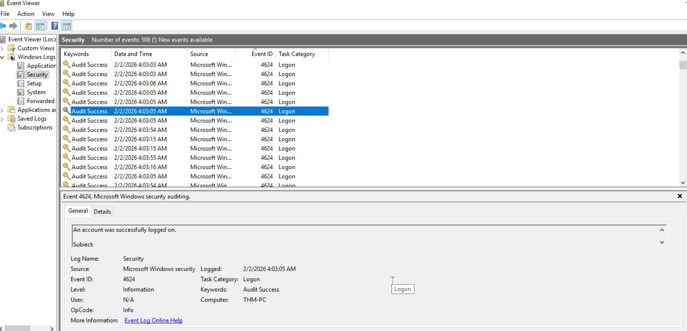

# Incident Report – Windows Logging for SOC

### Task 1 – Event Log Review (Successful Login Identification)

**Screenshot:** `screenshots/01-successful-logon-4624.jpg`

**Description / Analysis:**
- The screenshot shows Windows Event Viewer with the Security log selected and Event ID 4624 highlighted.
- Event ID 4624 represents a successful user authentication event used to track legitimate and suspicious logins.
- No abnormal behavior is observed at this stage, but this establishes a baseline for further investigation.

### Task 2 – Brute Force and Malicious RDP Detection (Event IDs 4624 & 4625)

**Screenshot:** `screenshots/02-bruteforce-rdp-main.jpg`

**Description / Analysis:**
- The screenshot shows Windows Event Viewer filtered for Security logs highlighting Event ID 4624 (successful login) for the Administrator account.
- The successful RDP login (Logon Type 10) is linked to Logon ID **0x183C36D**, confirming unauthorized access.
- Prior to the successful login, multiple failed login attempts (Event ID 4625) from IP **10.10.53.248** indicate a brute force attack.
- The Administrator account was breached as a result of these attempts.
- By referencing both failed and successful login events in the analysis, we demonstrate the ability to correlate log data and identify the sequence of malicious activity without needing multiple screenshots.

