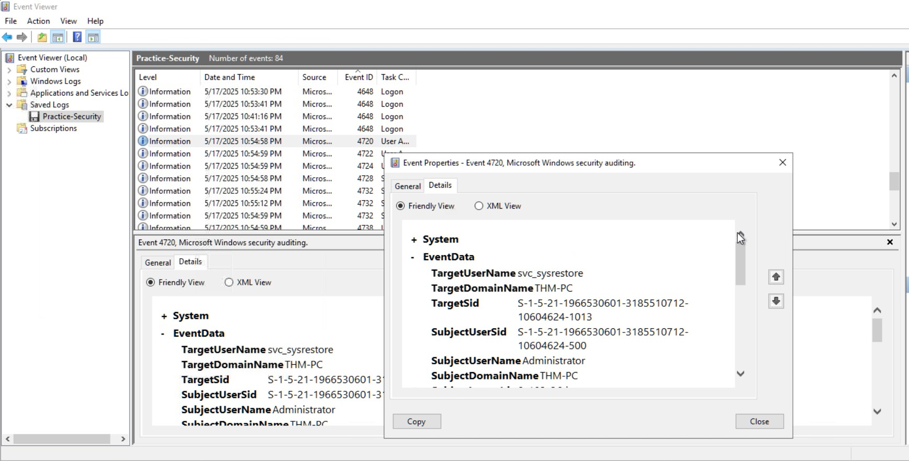
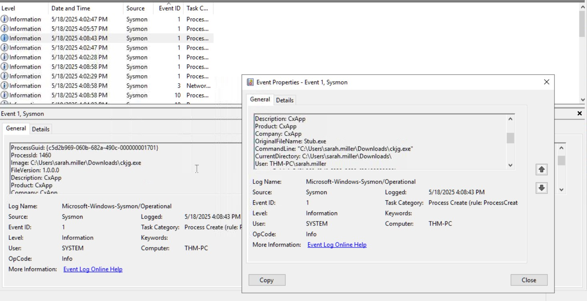
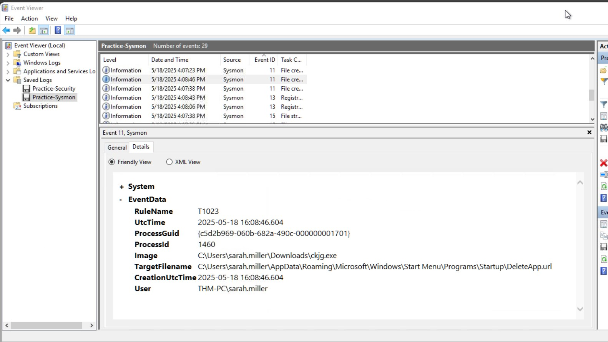

# Incident Report – Windows Logging for SOC

### Task 1 – Event Log Review (Successful Login Identification)

**Screenshot:** `screenshots/01-successful-logon-4624.jpg`

**Description / Analysis:**
- In the screenshot Event ID 4624 is highlighted and the Security log is selected in Windows Event Viewer.
- A successful user authentication is represented by the Event ID 4624. It's used to legitimate and suspicious logins.
- No abnormal behavior is observed at this stage, but this establishes a baseline for further investigation.

### Task 2 – Brute Force and Malicious RDP Detection (Event IDs 4624 & 4625)

**Screenshot:** `screenshots/02-bruteforce-rdp-main.jpg`

**Description / Analysis:**
- The screenshot displays Windows Event Viewer filtered for security logs, showing that the Administrator account login was successful (Event ID 4624).
- The successful RDP login (Logon Type 10) is linked to Logon ID **0x183C36D**, confirming unauthorized access.
- Prior to the successful login, multiple failed login attempts (Event ID 4625) from IP **10.10.53.248** indicate a brute force attack.
- The Administrator account was breached as a result of these attempts.

### Task 3 – User Management Events and Backdoor Account Detection

**Screenshot:** `screenshots/03-backdoor-user.jpg`

**Description / Analysis:**
- The screenshot shows Windows Event Viewer displaying a **4720 (user account created)** event for the backdoor account **svc_sysrestore**.
- This account was created immediately after the successful RDP login from Task 2, as indicated by the matching **Logon ID**.
- Additional events show that the backdoor user was added to the privileged groups: **Backup Operators** and **Remote Desktop Users**, granting it administrative and remote access capabilities.
- This demonstrates that the attacker created a persistent backdoor account and assigned it privileges to maintain control over the system.
- Correlating the Logon ID from the previous task confirms that the account creation is linked directly to the malicious session.

### Task 4 – Malicious File Download and Execution (Sysmon Analysis)

**Screenshot:** `screenshots/04-sysmon-malware-execution.jpg`

**Description / Analysis:**
- The screenshot shows a **Sysmon Event ID 1 (Process Creation)** log for the execution of **ckjg.exe**.
- The process was launched from the directory:  
  `C:\Users\sarah.miller\Downloads\ckjg.exe`, indicating it was downloaded from the internet.
- The parent process and command line fields indicate that the file was opened through **Google Chrome**, confirming the browser used.
- Additional Sysmon network events revealed that the file was downloaded from:  
  `http://gettsveriff.com/bgj3/ckjg.exe`.
- The Logon ID matches Sarah’s session, linking this activity directly to the compromised user account.
- This confirms that the attacker gained access by tricking the user into downloading and executing a malicious file.
- This activity likely enabled further lateral movement and brute-force attacks against production servers.

### Task 5 – Malware Persistence and C2 Communication

**Screenshot:** `screenshots/05-sysmon-persistence-c2-domain.jpg`

**Description / Analysis:**
- This screenshot shows Sysmon logs indicating that malware created a persistence file in the Startup folder.
- It also shows outbound network communication to a suspected command-and-control server (193.46.217.4:7777).
- DNS logs reveal the domain hkfasfsafg.click associated with the malicious IP.
- These activities confirm that the malware established persistence and attempted remote control.

